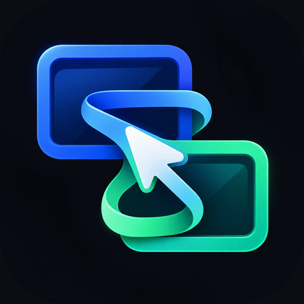

<p align="center">
  
</p>

<h1 align="center">TailRemote</h1>

<p align="center">
  A direct, private iPhone remote for your Mac.
</p>

<p align="center">
  
</p>

TailRemote is a small, open-source iPhone client for controlling a Mac through macOS Screen Sharing over Tailscale. It connects directly to the Mac: there is no relay, hosted service, account system, or companion app.

> TailRemote is an early MVP intended for personal use on a trusted tailnet.

## Features

- Apple Screen Sharing authentication through RoyalVNCKit
- Live remote framebuffer with a local pointer
- Relative touchpad-style pointer control, clicks, dragging, and scrolling
- Pinch zoom from 1× to 4× with manual panning and cursor edge-following
- iOS keyboard input plus Escape, Tab, and right-click shortcuts
- Remembered host and username; the password stays in memory only for the active connection

## Requirements

- An iPhone running iOS 17 or newer
- A Mac with **System Settings → General → Sharing → Screen Sharing** enabled
- Tailscale connected on both devices, or another trusted network path to TCP port `5900`
- Xcode 16 or newer for installing the development build
- A free or paid Apple Developer account for device signing

## Install on an iPhone

1. Clone the repository and open `TailRemote.xcodeproj` in Xcode.
2. Select the `TailRemote` target under **Signing & Capabilities**.
3. Choose your development team and set a bundle identifier unique to your account if Xcode requests one.
4. Select your connected iPhone and press **Run**.
5. Enter the Mac's Tailscale MagicDNS hostname or Tailscale IP, macOS username, and login password.

The hostname normally looks like `your-mac.your-tailnet.ts.net`. Screen Sharing uses port `5900`.

## Controls

| Gesture | Action |
| --- | --- |
| One-finger drag | Move the pointer |
| Tap / double-tap | Click / double-click |
| Hold, then drag | Drag a window, slider, or item |
| Two-finger tap | Right-click |
| Two-finger drag at 1× | Scroll the Mac |
| Pinch | Zoom from 1× to 4× |
| Two-finger drag while zoomed | Pan around the desktop |

While zoomed, moving the pointer near an edge automatically follows it around the desktop.

## Security model

- Tailscale provides private network reachability; it does not replace Screen Sharing authentication.
- TailRemote sends credentials only to the selected Screen Sharing server during the authentication handshake.
- The host and username are stored in iOS `UserDefaults` for convenience.
- The password is never written to disk or committed to the repository. It is cleared when the session disconnects.
- TailRemote does not open ports, operate a relay, collect analytics, or send telemetry.

Only connect to Macs and networks you trust. See [SECURITY.md](SECURITY.md) for reporting vulnerabilities and the supported threat model.

## Development

The generated Xcode project is committed so contributors can build immediately. [`project.yml`](project.yml) is its source of truth.

```sh
brew install xcodegen
xcodegen generate
xcodebuild -project TailRemote.xcodeproj \
  -scheme TailRemote \
  -destination 'platform=iOS Simulator,name=iPhone 16 Pro' \
  test
```

RoyalVNCKit is pinned to a tested revision in `project.yml` and `Package.resolved`. See [THIRD_PARTY_NOTICES.md](THIRD_PARTY_NOTICES.md) for dependency licenses.

## Known limitations

- One saved Mac profile
- No remote user discovery; Screen Sharing does not expose account names before authentication
- No audio, file transfer, or App Store distribution
- Keyboard support focuses on text entry and a small set of special keys

## Contributing

Read [CONTRIBUTING.md](CONTRIBUTING.md) before opening a pull request. Please keep the app direct, private, and deliberately small.

## License

TailRemote is available under the [MIT License](LICENSE).

TailRemote is not affiliated with or endorsed by Tailscale Inc. or Apple Inc. Tailscale and Apple product names are trademarks of their respective owners.
