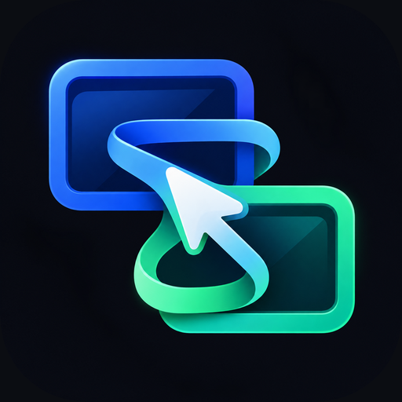

<p align="center">
  
</p>

<h1 align="center">TailRemote</h1>

<p align="center">
  A direct, private iPhone remote for your Mac.
</p>

<p align="center">
  
</p>

TailRemote is a small, open-source iPhone client for controlling a Mac through macOS Screen Sharing over Tailscale. It connects directly to the Mac: there is no relay, hosted service, account system, or companion app.

> TailRemote is an early MVP intended for personal use on a trusted tailnet.

## Features

- Apple Screen Sharing authentication through RoyalVNCKit
- Live remote framebuffer with a local pointer
- Relative touchpad-style pointer control, clicks, dragging, and scrolling
- Visible click pulses at the remote pointer, including double clicks and right clicks
- Pinch zoom from 1× to 4× with manual panning and cursor edge-following
- iOS keyboard input plus Escape, Tab, and right-click shortcuts
- Saved Mac picker with a remembered username per Mac and passwords in the iPhone Keychain
- Import Mac names and addresses from Tailscale without an API key

## Quick start

You need a Mac, an iPhone with iOS 17+, Xcode, and [Tailscale](https://tailscale.com/download) on both devices.

1. On your Mac, open **System Settings → General → Sharing** and enable **Screen Sharing**.
2. Clone and open TailRemote:

   ```sh
   git clone https://github.com/C4T4/TailRemote.git
   open TailRemote/TailRemote.xcodeproj
   ```

3. Connect your iPhone. In **Signing & Capabilities**, choose your Personal Team and set a unique bundle ID.
4. Select your iPhone in Xcode and press **Run**.
5. Choose your Mac from the picker, or use **Add a Mac** to enter its Tailscale address and macOS username. Enter your login password once.

**Remember password** is on by default. Sign in once to save it securely on this
iPhone; the matching Mac and username will have the password filled in next time,
including after closing the app. Turn the toggle off to remove that saved password.

### Import Macs from Tailscale

On your Mac, with Tailscale connected, run:

```sh
python3 scripts/export-tailscale-macs.py ~/Downloads/TailscaleMacs.json
```

Transfer that file to your iPhone and choose **Import Tailscale Macs** in the Mac
picker. It contains Mac names and private addresses, plus the current Mac's local
username, with no passwords or tokens. The picker remembers the imported devices;
export and import again to update it. This is a saved list, not live discovery from
the separate Tailscale iOS app. TailRemote never guesses another Mac's username.

For a connected development phone, the export can also be copied into the app's
Documents folder as `TailscaleMacs.json` with `devicectl device copy to` using the
`appDataContainer` domain and your app's bundle ID. The next launch imports the file
and removes that temporary copy. Keep exports outside the repository.

The shared TailRemote scheme uses **Release** for Run so Screen Sharing authentication
and screen decoding use optimized dependencies on your iPhone. Tests use **Debug**.
If you change Run to Debug for development, switch back to Release before comparing
connection speed or using the app regularly.

## Problems?

- Signing error: choose your Personal Team and change the bundle ID.
- Cannot connect: check Tailscale and Screen Sharing.
- Login fails: run `whoami` on your Mac and use that username.
- Startup now distinguishes **Connecting**, **Signing in**, and **Loading desktop**.
  It reports **Connected** when the first desktop image is available. Local console
  timings record these stages without hostnames, usernames, or passwords.

## Controls

| Gesture | Action |
| --- | --- |
| One-finger drag | Move the pointer |
| Tap / double-tap | Click / double-click |
| Hold still for about half a second, then drag | Drag a window, slider, or item |
| Two-finger tap | Right-click |
| Two-finger drag at 1× | Scroll the Mac |
| Pinch | Zoom from 1× to 4× |
| Two-finger drag while zoomed | Pan around the desktop |

While zoomed, moving the pointer near an edge automatically follows it around the desktop.
Pointer movement keeps the same on-screen sensitivity at every zoom level.

## Security model

- Tailscale provides private network reachability; it does not replace Screen Sharing authentication.
- TailRemote sends credentials only to the selected Screen Sharing server during the authentication handshake.
- The host and username are stored in iOS `UserDefaults` for convenience.
- With **Remember password** enabled, a successful sign-in saves the password in
  the iPhone Keychain for that host, port, and username. It is available only while
  the device is unlocked and does not sync to iCloud or migrate to another device.
- Passwords are never stored in `UserDefaults`, logs, or the repository. The active
  session's in-memory password is cleared on disconnect. Turning off **Remember
  password** removes the saved password for the selected Mac and account.
- TailRemote does not open ports, operate a relay, collect analytics, or send telemetry.

Only connect to Macs and networks you trust. See [SECURITY.md](SECURITY.md) for reporting vulnerabilities and the supported threat model.

## TestFlight / App Store

Distribution under Waack International LLC uses bundle ID `com.waack.TailRemote`. See [TESTFLIGHT.md](TESTFLIGHT.md) and [PRIVACY.md](PRIVACY.md). Hosted policy: https://c4t4.github.io/TailRemote/privacy/

## Development

The generated Xcode project is committed so contributors can build immediately. [`project.yml`](project.yml) is its source of truth.

```sh
brew install xcodegen
xcodegen generate
xcodebuild -project TailRemote.xcodeproj \
  -scheme TailRemote \
  -destination 'platform=iOS Simulator,name=iPhone 16 Pro' \
  test
```

RoyalVNCKit is pinned to a tested revision in `project.yml` and `Package.resolved`. See [THIRD_PARTY_NOTICES.md](THIRD_PARTY_NOTICES.md) for dependency licenses.

## Known limitations

- Tailscale device imports are snapshots and do not refresh automatically
- No remote user discovery; Screen Sharing does not expose account names before authentication
- No audio or file transfer
- Keyboard support focuses on text entry and a small set of special keys

## Contributing

Read [CONTRIBUTING.md](CONTRIBUTING.md) before opening a pull request. Please keep the app direct, private, and deliberately small.

## License

TailRemote is available under the [MIT License](LICENSE).

TailRemote is not affiliated with or endorsed by Tailscale Inc. or Apple Inc. Tailscale and Apple product names are trademarks of their respective owners.
